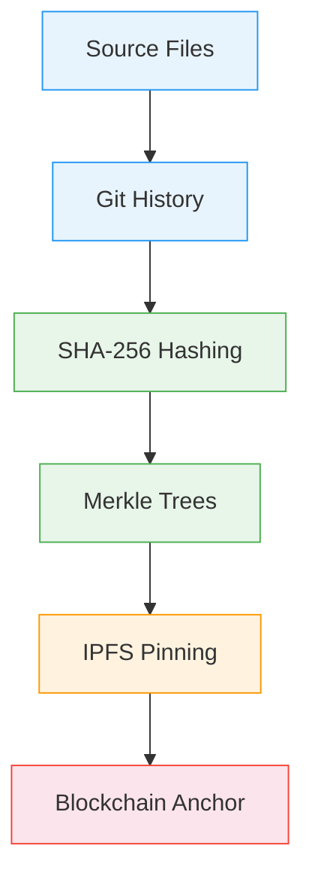
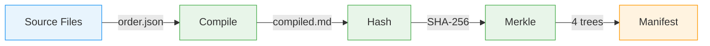
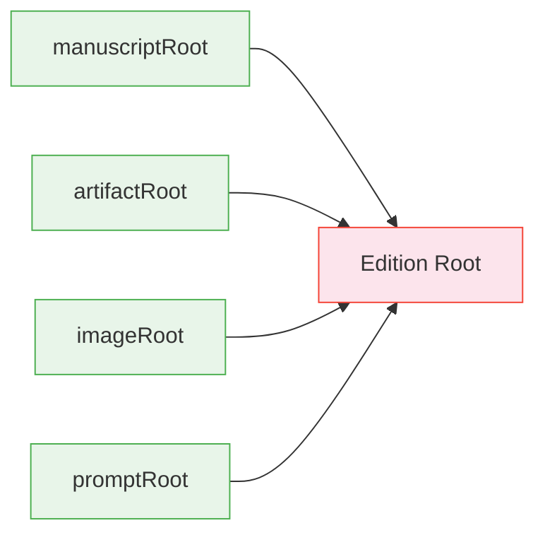
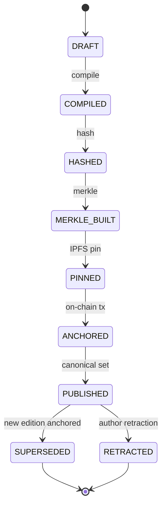
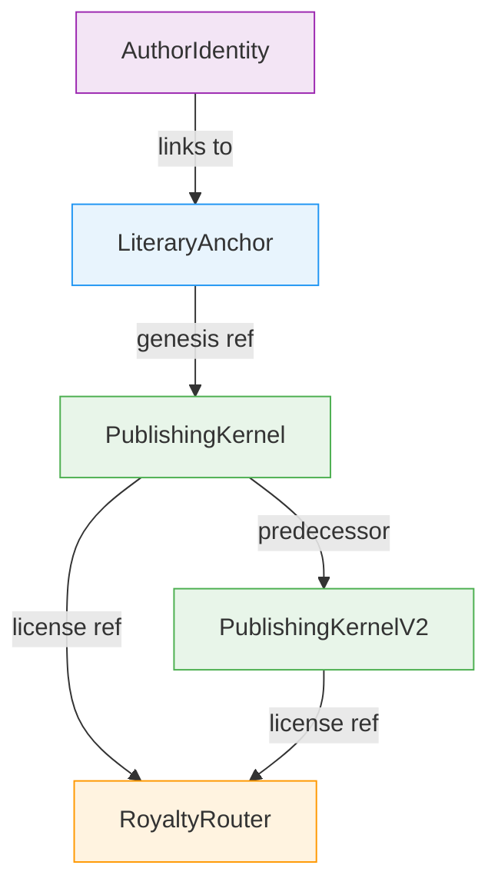
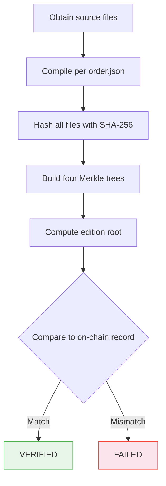

# LPS-1 Reference Implementation

### Deterministic Literary Publishing Protocol

[](LICENSE)
[](https://soliditylang.org/)
[](https://nodejs.org/)
[](#test-coverage)
[](#deterministic-guarantees)

---

## Table of Contents

- [Executive Summary](#executive-summary)
- [Protocol Overview](#protocol-overview)
- [Architecture](#architecture)
- [Deterministic Pipeline](#deterministic-pipeline)
- [Merkle Construction Rules](#merkle-construction-rules)
- [Edition Root Definition](#edition-root-definition)
- [State Machine](#state-machine)
- [Smart Contract Architecture](#smart-contract-architecture)
- [Verification Procedure](#verification-procedure)
- [Conformance Model](#conformance-model)
- [Security Considerations](#security-considerations)
- [Local Demo](#local-demo)
- [Test Coverage](#test-coverage)
- [Why Determinism Matters](#why-determinism-matters)
- [What This Is Not](#what-this-is-not)
- [Specifications](#specifications)
- [License](#license)

---

## Executive Summary

LPS-1 is an open protocol for anchoring structured documents on a
blockchain with cryptographic integrity guarantees. It provides a
deterministic pipeline that transforms source files into verifiable
Merkle trees, producing a single edition root that can be recorded
on-chain and independently verified by any third party.

This repository is the canonical reference implementation. It contains
five Solidity smart contracts, a deterministic build pipeline, an
independent verifier, a sample literary work, and a comprehensive
test suite. It is designed to be fully reproducible, self-contained,
and safe for public distribution.

No private keys. No mainnet dependencies. No business logic.
Protocol infrastructure only.

---

## Protocol Overview

LPS-1 defines a five-layer provenance stack that binds authorship
to cryptographic proof at every level:



Each layer is independently verifiable. The protocol does not require
trust in any single party, platform, or service. A verifier with access
to the source files and the blockchain record can reconstruct and
confirm every hash, root, and signature.

---

## Architecture

```
LPS-1-Reference-Implementation/
│
├── contracts/                 Smart Contracts
│   ├── LiteraryAnchor.sol         Proof-of-origin anchor
│   ├── PublishingKernel.sol        Edition management, Merkle roots, licenses
│   ├── PublishingKernelV2.sol      ECDSA enforcement, timelock, freeze
│   ├── RoyaltyRouter.sol           Revenue splits, recoupment waterfall
│   └── AuthorIdentity.sol          Identity declaration, bibliography
│
├── pipeline/                  Deterministic Build Pipeline
│   ├── compile.js                 Canonical manuscript compilation
│   ├── hash.js                    SHA-256 with CRLF normalization
│   ├── merkle.js                  Four-tree Merkle construction
│   └── manifest.js                Integrity manifest generation
│
├── verifier/                  Independent Verification
│   ├── lps-verify.js              Recompute and verify all integrity data
│   └── cli.js                     Command-line interface
│
├── example-work/              Sample Literary Work
│   ├── order.json                 Canonical file ordering
│   ├── manuscript/                Source text files (5)
│   ├── artifacts/                 Supplementary files
│   ├── images/                    Cover art, illustrations
│   └── prompts/                   AI prompt transparency log
│
├── scripts/                   Deployment and Demo
│   ├── deploy-local.js            Deploy all contracts to local Hardhat
│   ├── anchor-edition.js          Anchor an edition from pipeline output
│   └── demo.js                    Full pipeline demonstration
│
├── spec/                      Protocol Specifications
│   ├── LPS-1.md                   Literary Protocol Standard (RFC-style)
│   └── IAPL-1.md                  Immutable Audio Publishing Layer
│
├── test/                      Test Suites
│   ├── contract.test.js           37 smart contract tests
│   └── pipeline.test.js           21 pipeline determinism tests
│
└── docker/                    Reproducible Builds
    └── Dockerfile                 Containerized verification environment
```

---

## Deterministic Pipeline

The pipeline transforms source files into a verifiable integrity record
through four sequential stages. Each stage is stateless and produces
identical output for identical input, regardless of platform.



| Stage | Input | Output | Guarantee |
|-------|-------|--------|-----------|
| **Compile** | `order.json` + manuscript files | `compiled.md` | Canonical ordering, `\n\n` separation |
| **Hash** | All edition files | `hashes.json` | SHA-256, CRLF normalization for `.md` |
| **Merkle** | Hashed file inventory | `merkle.json` | Four independent trees, odd-leaf duplication |
| **Manifest** | Roots + metadata | `manifest.json` | Complete integrity record |

### Encoding Rules

- All text files: UTF-8, no BOM
- Line endings: CRLF-normalized before hashing (`.md` files only)
- Binary files: hashed as raw byte streams
- Hash output: lowercase hexadecimal, 64 characters

### Ordering Rules

Files are processed in the exact order specified by `order.json`.
Filesystem sort order is never used. This eliminates locale-dependent
ordering differences across operating systems.

### CRLF Normalization

Before hashing, all markdown files are normalized:

```
normalized = text.replace(/\r\n/g, "\n").replace(/\n/g, "\r\n")
```

This produces identical hashes on Windows, macOS, and Linux.

---

## Merkle Construction Rules

LPS-1 builds four independent Merkle trees, one for each content
category:

| Tree | Content | Required |
|------|---------|----------|
| `manuscriptRoot` | Ordered text files | Required |
| `artifactRoot` | EPUB, PDF, supplementary files | Optional |
| `imageRoot` | Cover art, illustrations | Optional |
| `promptRoot` | AI prompt logs | Optional |

If a category contains no files, its root is `SHA-256("empty")`.

### Construction Algorithm

1. Compute the SHA-256 leaf hash for each file
2. Pair leaves left to right: `parent = SHA-256(left + right)`
3. If a level has an odd number of nodes, duplicate the last node
4. Repeat until a single root remains

Concatenation is string concatenation of hex digests:

```
parent = SHA-256("a1b2c3d4..." + "e5f6a7b8...")
```

### Odd Leaf Rule

When a tree level has an odd number of nodes, the last node is
duplicated to form a complete pair:

```
[A, B, C]  →  [SHA-256(A + B), SHA-256(C + C)]
```

This is consistent with Bitcoin's Merkle tree construction and ensures
deterministic results regardless of file count.

---

## Edition Root Definition

The edition root is the canonical identifier for an edition. It combines
all four Merkle roots into a single SHA-256 hash:



```
editionRoot = SHA-256(manuscriptRoot + artifactRoot + imageRoot + promptRoot)
```

The concatenation order is fixed and must not be reordered. Changing
any file in any category produces a different edition root.

---

## State Machine

An edition progresses through a defined set of states. Transitions
are append-only; no state can be reverted or erased.



| State | Description |
|-------|-------------|
| `DRAFT` | Source files exist but have not been compiled |
| `COMPILED` | Manuscripts concatenated per ordering rules |
| `HASHED` | All files hashed with SHA-256 |
| `MERKLE_BUILT` | Four Merkle trees constructed, edition root computed |
| `PINNED` | Content pinned to IPFS with content identifier |
| `ANCHORED` | Edition root recorded on-chain |
| `PUBLISHED` | Edition marked as canonical |
| `SUPERSEDED` | Replaced by a newer edition (data preserved) |
| `RETRACTED` | Withdrawn by the author (data preserved) |

---

## Smart Contract Architecture

Five contracts implement the on-chain layer of LPS-1:

### LiteraryAnchor

Minimal proof-of-origin. Stores title, IPFS CID, SHA-256 hash, and
author address. Supports append-only edition history. No admin logic,
no upgradeability.

### PublishingKernel

Full edition management. Stores five Merkle roots per edition, supports
canonical designation, supersession, retraction, and a license registry
with territory, term, and revenue-split references.

### PublishingKernelV2

Hardened variant with ECDSA signature verification on every anchor
operation. Adds per-edition freeze (seal), 48-hour timelock on
destructive operations, and an optional admin role for multi-signature
readiness.

### RoyaltyRouter

Programmable revenue distribution. Constructor accepts payees, roles,
and basis points (must sum to 10,000). Supports a recoupment waterfall
for advance recovery before standard splits. Uses the pull-based
withdrawal pattern for gas efficiency and reentrancy safety.

### AuthorIdentity

On-chain identity declaration. Stores real name, pseudonym, organization,
domain, and external URL. Maintains an append-only bibliography and
a registry of linked contracts.



---

## Verification Procedure

Any party with access to the source files can independently verify
an edition:



The verifier included in this repository performs this procedure
automatically:

```bash
npm run verify
# or
node verifier/cli.js --path example-work
```

It checks:

1. File hashes match recorded values
2. Merkle roots match recomputed trees
3. Edition root matches combined root computation
4. Compiled hash matches the compiled manuscript
5. All Merkle proofs verify

---

## Conformance Model

LPS-1 defines four conformance roles:

| Role | Responsibility |
|------|---------------|
| **Reader** | Accesses published content; no verification required |
| **Verifier** | Independently reconstructs hashes, trees, and roots; confirms integrity |
| **Publisher** | Runs the deterministic pipeline; produces manifest and Merkle data |
| **Anchor** | Records the edition root on-chain; provides the immutable reference |

### Conformance Levels

**Level 1 — Basic:** Deterministic compile, SHA-256 hashing, manuscript
Merkle tree, edition root, on-chain storage.

**Level 2 — Full:** All of Level 1, plus all four Merkle trees, ECDSA
provenance signatures, timelock for retractions, independent manifest.

**Level 3 — Extended:** All of Level 2, plus audio binding (IAPL-1),
license registry, royalty routing, identity declaration.

This reference implementation achieves **Level 3** conformance.

---

## Security Considerations

Detailed security analysis is provided in [SECURITY.md](SECURITY.md).

Key points:

- **SHA-256** (FIPS 180-4) — no practical collision attacks known
- **ECDSA** (secp256k1) — standard Ethereum signature scheme
- **Immutability** — contracts are non-upgradeable by design
- **No admin backdoors** — the only authorized address is the author
- **Pull-based withdrawals** — prevents reentrancy in RoyaltyRouter
- **48-hour timelock** — guards against impulsive or coerced retractions
- **IPFS availability** — content-addressed, not hosted; multiple pins recommended

---

## Local Demo

```bash
# Clone and install
git clone https://github.com/FTHTrading/LPS-1-Reference-Implementation.git
cd LPS-1-Reference-Implementation
npm install

# Run the full pipeline demo
npm run demo
```

The demo executes the complete pipeline — compile, hash, Merkle, manifest,
verify — and prints deterministic results:

```
RESULT: 17 PASS / 0 FAIL
```

### Step-by-Step Execution

```bash
npm run compile       # Concatenate manuscript files
npm run hash          # SHA-256 the compiled output
npm run merkle        # Build Merkle trees + edition root
npm run manifest      # Generate integrity manifest
npm run verify        # Independent verification
```

### Local Contract Deployment

```bash
# Terminal 1: Start local Hardhat node
npx hardhat node

# Terminal 2: Deploy all five contracts
npx hardhat run scripts/deploy-local.js

# Terminal 3: Anchor an edition from pipeline output
npm run build
npx hardhat run scripts/anchor-edition.js
```

### Docker

```bash
docker build -t lps1-ref -f docker/Dockerfile .
docker run --rm lps1-ref npm run demo
docker run --rm lps1-ref npm run test:all
```

---

## Test Coverage

```bash
npm test              # Smart contract tests (37)
npm run test:pipeline # Pipeline determinism tests (21)
npm run test:all      # Full suite (58)
```

| Suite | Tests | Coverage |
|-------|-------|----------|
| LiteraryAnchor | 6 | Constructor, editions, access control |
| PublishingKernel | 8 | Genesis, anchoring, canonical, licenses, supersede, retract |
| PublishingKernelV2 | 9 | ECDSA, freeze, timelock, admin |
| RoyaltyRouter | 6 | Splits, distribution, withdrawal, recoupment, emergency |
| AuthorIdentity | 8 | Identity, works, batch, linking, access control |
| SHA-256 Hashing | 5 | Consistency, CRLF normalization, known values |
| Merkle Construction | 6 | Empty, single, pair, odd, determinism |
| Merkle Proofs | 4 | Verification, wrong leaf, wrong root |
| Edition Root | 2 | Combination, empty trees |
| Example Work | 4 | File inventory, deterministic hashes, tree validity |

---

## Why Determinism Matters

A publishing protocol must produce identical output regardless of when,
where, or by whom it is executed. Without determinism, verification is
impossible — a verifier could never be certain that a difference in
output represents tampering rather than an implementation artifact.

LPS-1 achieves determinism through:

- **Explicit file ordering** via `order.json` (no filesystem sort)
- **CRLF normalization** before hashing (no platform-dependent line endings)
- **UTF-8 encoding** only (no ambiguous character sets)
- **SHA-256** (no non-deterministic hash functions)
- **Odd-leaf duplication** (no ambiguous tree shapes)
- **Fixed concatenation order** for the edition root

Any implementation that follows these rules will produce the same
edition root for the same source files. This is the foundation on
which every verification claim rests.

---

## What This Is Not

- **Not an NFT marketplace.** LPS-1 is provenance infrastructure. It does not mint, sell, or transfer tokens.
- **Not a DRM system.** The protocol proves authorship; it does not restrict access.
- **Not centralized publishing.** There is no platform, no gatekeeper, no approval process.
- **Not a content hosting solution.** IPFS provides content addressing, not availability guarantees.
- **Not a business model.** This repository contains no pricing, revenue, or commercial logic.

---

## Specifications

- [LPS-1: Literary Protocol Standard](spec/LPS-1.md) — Full RFC-style specification
- [IAPL-1: Immutable Audio Publishing Layer](spec/IAPL-1.md) — Audio binding extension
- [SECURITY.md](SECURITY.md) — Threat model and security analysis

---

## No Production Data

This repository contains zero production addresses, private keys,
mainnet RPC endpoints, or business logic. It is a clean-room protocol
implementation designed for public review and independent verification.

---

## License

MIT — see [LICENSE](LICENSE)

---

*An open standard for verifiable digital authorship and structured media provenance.*

*Built by [FTH Trading](https://github.com/FTHTrading)*
